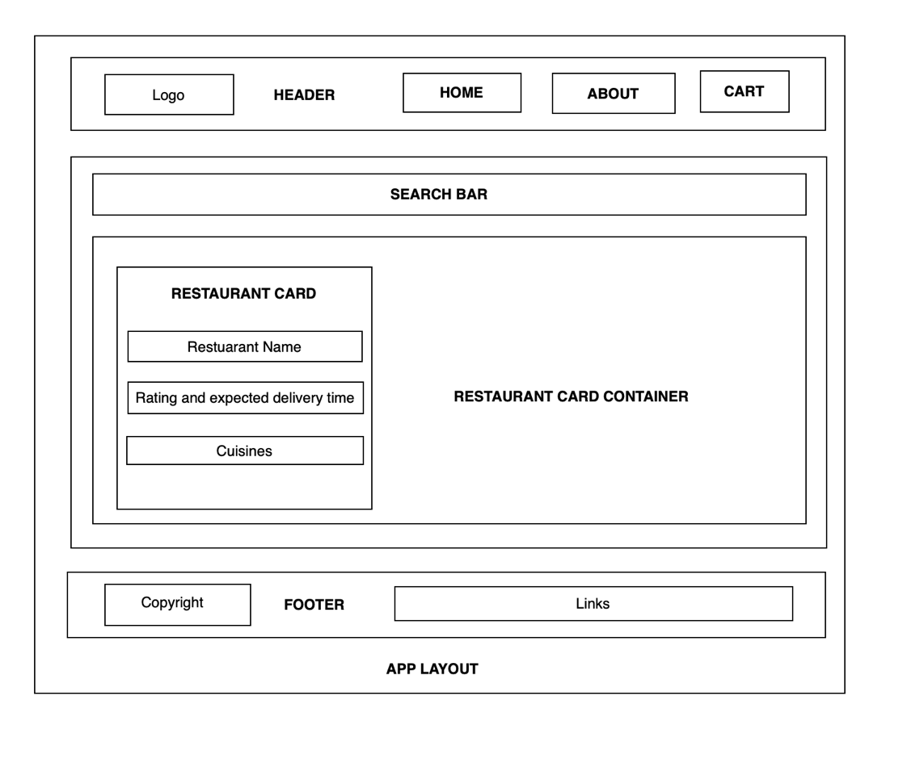

The high level diagram is here: 

The low level details were documented here: [Low level details](../Low-Level-Design-Food-Villa.txt)

In case the Swiggy API contract to fetch the list of restaurants/ Cloudinary CDN URL changes, please update the URL [here](./code/utils/constants.js) and make the relevant destructuring changes in [Body Component](./code/src/components/Body.js) and [RestaurantCard Component](./code/src/components/RestaurantCard.js)

We are using an API to get the restauarant menu from Swiggy API which can be found here [Swiggy Restaurants Menu API](./code/utils/constants.js). In case this API contract changes, please make the changes here [RestaurantMenu](./code/src/components/RestaurantMenu.js), [MenuCategory](./code/src/components/MenuCategory.js) and [ItemList](./code/src/components/ItemList.js)

Please note that we might need to enable `Allow CORS` extension in the browser to see the live link, as Swiggy API sometimes reads the User Agent of the host machine and sends a different API response than for the desktop view.

# Session 11 of Namaste React course:

## Topics covered in this session:

- State lifting
- Prop drilling
- Context

### **Live Link: [here](https://foodvilla-girik.netlify.app/)**

Here's a snapshot of the configuration needed to deploy the application on Netlify:

