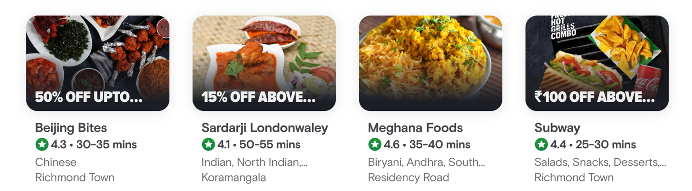
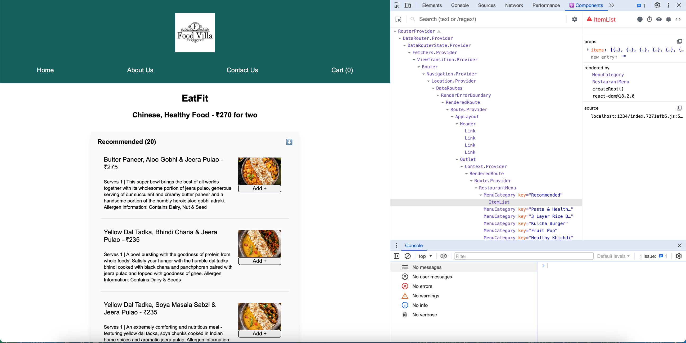
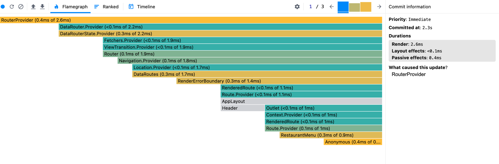

**Let's learn about Higher Order Components in React**

This is discussed in chapter 11 `Data is the new Oil` part-1.

**What is higher order component in React?**

A higher order component is a normal Javascript function that takes a component as an argument and returns a new component.

**Why is a higher order component used? Give some examples**

A higher order component is used because it takes a component as a parameter, performs some operations on it and returns a new component. As an example, consider the Restaurant Cards from Swiggy:



We can see from the image above that certain restaurant cards display discount offers. But these restaurant cards are pretty much the same as any other card which don't have an offer. So, we are actually rendering a Higher Order Component (HOC) to show the card with the offer. We are passing the restaurant card component to the HOC, which appends the offer label, apart from invoking the `RestaurantCard` component. These HOCs are then rendered in the Body Component.

For our project, we are going to build a feature to display a label `Top rated` for restaurants that have a rating greater than or equal to 4.5.

Before coding a Higher Order Component, first carefully think about the contract of the Higher Order Component - what parameters would the HOC receive and what would it return. It can be confusing to code the HOC without having the contract clear in the mind.

So, for our case, we will have an HOC - a normal Javascript function that takes `RestaurantCard` component as an argument. It would return a new component with the label and internally invoke the `RestaurantCard` component as well. 

Let's see the higher order component in action [here](../code/src/components/RestaurantCard.js) and see this HOC being invoked from [Body Component](../code/src/components/Body.js)


We have also built the `Accordion` feature in the restauarant menu here. This is discussed in chapter 11 part 2 - `Data is the new Oil`.

**Design of Accordion**

In order to design the accordion, we fetched the restaurant menu information from Swiggy's APIs using a dynamic route. Corresponding to every restauarant, we have a `RestaurantMenu` component. Corresponding to the different categories in the menu, we have a `MenuCategory` component which corresponds to the `accordion tab`. For every `accordion tab`, we show the accordion body by using the `ItemList` component.

**Let's now discuss about a single collapsible accordion**

Let's not look at how we can build a single collapsible accordion- what we mean by this is that at max one accordion tab can be expanded. If another accordion tab is expanded, then the previous accordion tab is collapsed.

This is discussed in Chapter-11 `Data is the new oil` part 3. We'll learn an important concept of 'lifting the state up' through this exercise.

**Let's also explore about React DevTools :**

React DevTools is a useful browser extension which allows to inspect the React component hierarchies. As an example, see the screenshot below where the `Component tab` shows the hierarchy of the `ItemList` component:



What's also interesting is the fact that we can see the DOM on the left hand side and the data layer (the props, source etc) on the right hand side.

Let's also experiment with `Profiler` from `React DevTools`. Profiler allows us to record the activity in the React App, and shows us the different components which are rendered during the profiling along with the time taken for each component to load. This can be useful to identify parts of an application that are slow and may benefit from optimizations such as memoization. See the screenshot below:



**Let's understand the problem with the help of a diagram:**


The `Restaurant Menu` is the parent component for all the individual `Accordion` components. Each `Accordion` component is managing its own state internally by using a state variable. Now, if we want to collapse one `Accordion` component when another `Accordion` is expanded, the data needs to be passed from one `Accordion` component to another, but this isn't possible in React, since the data can't flow between siblings in React. Hence, we need to "lift the state up", what this means is that instead of having the state variable to show/hide the accordion at the Accordion component (child component), the state variable should instead be lifted to the Restaurant Menu component (parent component). The parent component thus controls the behaviour of the child component.

This brings us to the concept of `Controlled components` and `Uncontrolled components` in React. Let's discuss them:

An `Uncontrolled component` is a component which manages its own state and is not controlled by any other parent component. As an example, the `Accordion` component below is an uncontrolled component, as it manages its own state and is not dependent on its parent component:

```
const MenuCategory = ({ data }) => {
  const [showAccordionBody, setShowAccordionBody] = useState(false);

  const handleButtonClick = () => {
    setShowAccordionBody(!showAccordionBody);
  };

  return (
    <div className="accordion-header">
      <div className="accordion-body" onClick={handleButtonClick}>
        <span className="accordion-header-title">
          {data.title} ({data.itemCards.length})
        </span>
        <span> ⬇️ </span>
      </div>
      {showAccordionBody && <ItemList items={data.itemCards} />}
    </div>
  );
};
```

On the other hand, a controlled component is a component which doesn't maintain its own state. Instead the behaviour of the child component is controlled by the parent component. As an example below, the `MenuCategory` component is a controlled component, as the behaviour of this component is controlled by the props passed down from the parent component `RestaurantMenu`.

```
const MenuCategory = (props) => {
  const { data, accordionIndex, index, openCallBack, closeCallBack } = props;

  const handleButtonClick = () => {
    if (index == accordionIndex) closeCallBack();
    else openCallBack(index);
  };

  return (
    <div className="accordion-header">
      <div className="accordion-body" onClick={handleButtonClick}>
        <span className="accordion-header-title">
          {data.title} ({data.itemCards.length})
        </span>
        <span> ⬇️ </span>
      </div>
      {index == accordionIndex && <ItemList items={data.itemCards} />}
    </div>
  );
};
```

Coming back to the topic, let's discuss in detail how we can design the single collapsible accordion.

We render the `accordion` conditionally, meaning that only the `accordion` only if the specific accordion's index equals `acccordionIndex`. The `accordionIndex` state variable is maintained at the parent component. In order to set and unset the `accordionIndex` from the child component, we need to find a work around since the data in React typically flows from parent to child components, and not the other way around. In order to overcome this limitation, we pass an `openCallBack` and `closeCallBack` from the parent component to the child component. The child component can invoke these callbacks and modify the `accordionIndex` state variable.

**Let's now explore about prop drilling and context in React**

This is originally a part of Chapter-11 `Data is the New Oil` part-4.

Let's first understand what prop drilling is.

Whenever we have a deep hierarchy of React components, we can pass the props from the source component to the destination component by drilling it through the intermediate components. This is known as "props drilling", as we are drilling the props through the components.

Prop drilling is a problem as in large scale frontend applications with a deep hierarchy of components, readability of code becomes a problem. Also, the data flow becomes messy and confusing in such a case.

As a solution to avoid prop drilling, we can use `context APIs` or state management libraries like `Redux`.

React Context is like a central place where we can store the data. This data can be accessed from anywhere inside the app. Examples of data which can be stored inside a context (data that may be required at multiple places in the React app) are information about the logged in user, information about the theme (light theme/dark theme) etc.

For our project's usecase, we are using the `Context APIs` to store the information about the username. We are consuming the information from the context in `About` and `Footer` components.

Let's see how we can do this:

First of all, we need to create the context. As an example, we are creating the UserContext here.

```
import { createContext } from "react";

const UserContext = createContext({ userName: "" });

export default UserContext;
```

In order to set the userName property inside the context, we import the `UserContext`. In order to access the data from this context in a functional component, we use the `useContext` API. We set the property in the context, just like setting a property of an object. See the snippet below:

```
import { useContext } from "react";
import UserContext from "../../utils/UserContext.js";

const Body = () => {
  const userContext = useContext(UserContext);
  const handleButtonClick = () => {
    if (userName != "") {
      userContext.userName = userName;
      setIsLoggedIn(true);
    }
  };
}
```

In order to read the data from this context in a functional component, we import the `UserContext` and use the `useContext` hook. See the code snippet below:

```
import { useContext } from "react";
import UserContext from "../../utils/UserContext.js";

const Footer = () => {
  const userContext = useContext(UserContext);
  return (
      <div> Hope you are doing awesome, {userContext.userName} ! </div>
  );
};
```

Let's see how we can use `context APIs` in class based components:

As we know that hooks are not present in class based components, we cannot use `useContext` API to subscribe to the context. Instead, we need to use `Context.Consumer` in order to read data from the context. Within the consumer component, we need to define a callback function to access the data from the context. See the example below:

```
<UserContext.Consumer>
  {(userInfo) => (
    <h2 className="about-heading"> Hello {userInfo.userName} ! 👋</h2>
  )}
</UserContext.Consumer>
```

Let's also learn about `Context.Provider`. `Context.Provider` is used to provide the values to the child components. As an example, consider the following syntax:

```
<UserContext.Provider value={{loggedInUser:userName}}>
<Body>
</UserContext.Provider>
```

Here, we are setting the `loggedInUser` property from `UserContext`. This context is available to all the child components of `UserContext`, which in our case is the `Body` component. 

Let's consider another example:

```
<UserContext.Provider value={{loggedInUser: 'Outer'}}>
  <Header />
  <UserContext.Provider value={{loggedInUser: 'Inner'}}>
  <Body />
  </UserContext>
  <Footer />
</UserContext>
```

In the code snippet above, we'll have `loggedInUser` as `Outer` in the `Header` and `Footer` components. However, we'll have `loggedInUser` as `Inner` in the `Body` component. Hence we conclude that `Context.Provider` allows us to define the scopes for context.

**Then what's the difference between Provider API and setting the context variable by assignment to `context.stateVariable`**

Assignment to the `context.stateVariable` assigns the value at the global level, meaning that all the components will subscribe to the same value from context.

In contrast, the Provider API allows us to define the scope for context.

**For small or medium sized frontend application, React context APIs are sufficient to handle the data layer of the application. State management libraries like Redux or Apollo should be explored in case of large scale frontend applications**

**This doesn't mean that Context APIs are not powerful enough to be used in large scale applications, but it's the industry standard to use Redux in large scale applications**