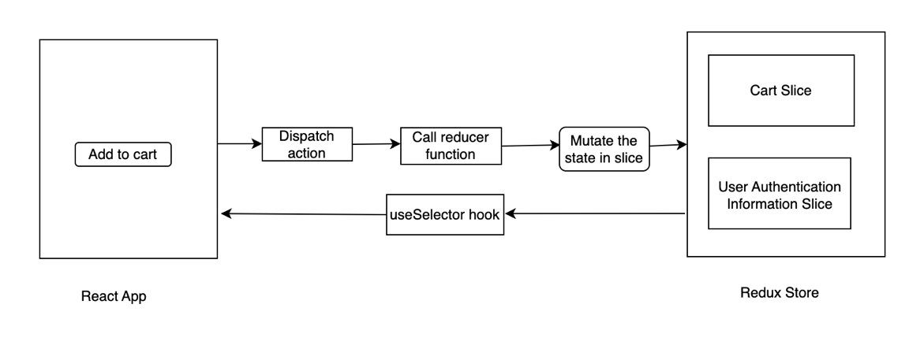

Let's learn how we can use `Redux` in our application to create the functionality of `cart` in our food ordering app.

As discussed earlier, a React application has two layers: UI layer and the data layer. State management libraries like `Redux` deal with powering the data layer of the React app.

**Part 1**

Before we begin, we need to know that `Redux` is **not mandatory** for our frontend application. `Redux` is best suited for large scale frontend applications, where a lot of data is used in the application and the component hierarchy is complex. For small or mid scale frontend applications, using `Context APIs` is sufficient in most cases.

It's also important to note that `React` and `Redux` are two different libraries. `Redux` is not a part of the `React` library, we can use `Redux` library along with `React` for state management.

Apart from Redux, there are other state libraries as well like `Zustand`, `Apollo` etc.

There are many benefits of using `Redux` in our application, like:

- Effectively handling data in our application
- Redux offers easy debugging. With the help of `Redux DevTools` extension, we can visualise the data from `Redux` in our application efficiently.

**Part-2**

Let's explore about Redux from the official [documentation](https://redux.js.org/) of Redux.

The documentation describes Redux as `A Predictable State Container for JS Apps`. It's important to note that Redux can be used with a wide variety of JS libraries and frameworks, not just React. That being said, Redux is very often used with React.

The documentation mentions two libraries related to Redux, `Redux Toolkit` (a.k.a RTK) and `React-Redux`. `Redux Toolkit` is the core Redux library which provides state management capabilities, whereas `React-Redux` library is used to connect the Redux state management to React.

It's important to note that `Redux Toolkit` (RTK) is different than the `Vanilla Redux` library. `Redux Toolkit` is the latest way to use `Redux` library, and is also less complicated than the `vanilla Redux` library.

**Part 3**

Let's first understand the architecture of `Redux Toolkit`. Learning `Redux` comes with an initial learning curve, so let's first understand the underlying architecture. Once we are good with the theoretical understanding, writing code is going to be a cakewalk.

Let's understand what feature we are going to build: we are going to build a feature where a user can add a food item to the cart from the restaurant menu. We will have a cart page where the user can see all the food items that they have added to the cart, also the number of items that have been added to the cart would be visible in the `Header` section. Hence, it is a perfect usecase for using `Redux` store.

Let's understand the architecture of `Redux`:

We have a `store` in `Redux`. We can think of the `store` as a big global object which holds the data. A `Redux store` is composed of many smaller parititions called `slices`. Each `slice` holds specific information, as an example, we can a have slice which holds user authentication information, another slice might hold theme information etc.

For our usecase, we will be using a cart slice in the `Redux` store. The cart slice will have an array of restaurant menu objects.

See the diagram below:



When we click on `Add to Cart` from the React app, it **dispatches an action**. The action, in turn **calls a reducer function**. The reducer function **mutates the state in the slice**.

In order to read data from the store in the React app, we **subscribe to the Redux store using useSelector hook**

**Part-4 Let's code**

Now that we have understood the architecture of `Redux` well, we can implement Redux store in our app.

We'll undertake the following steps to configure `Redux Toolkit` for our application:

1. Install `@reduxjs/toolkit` and `react-redux` libraries
2. Build the store
3. Provide the Redux store to our React app
4. Build the cart slice
5. Provide the slice to the store
6. Dispatch an action from the React app to update data in the store
7. Subscribe to the Redux store in the React application

For steps 2-6, this [documentation](https://redux-toolkit.js.org/tutorials/quick-start) should prove useful.

For step #3, we don't need to provide the Redux store to the entire React application, we can provide it to some child component as well. The idea being that `Redux store` needs to be provided to the parent component, where we feel that the child components might need to subscribe to the store.

Let's understand the syntax of creating a slice and explore some of the FAQs:

```
import { createSlice } from "@reduxjs/toolkit";

const cartSlice = createSlice({
  name: "cart",
  initialState: { items: [] },
  reducers: {
    addItem: (state, action) => {
      state.items.push(action.payload);
    },
    removeItem: (state, action) => {
      const index = state.items.indexOf(action.payload);
      if (index != -1) state.items.splice(index, 1);
    },
    clearCart: (state) => {
      state.items.length = 0;
    },
  },
});

export const { addItem, removeItem, clearCart } = cartSlice.actions;
export default cartSlice.reducer;
```

**FAQs:**

Q1. What is the use of defining the "name" property in the slice?

A1. The "name" property in the slice is used to uniquely identify each slice. This is useful when we want to combine the slice reducer with other reducers using `combineReducers()` function.

This is the syntax for `combineReducers()` function:

```
combineReducers({
  posts: postsReducer,
  comments: commentsReducer
})
```

Hence, we need to uniquely identify each slice, and hence the `name` property is used.

Q2. What are the actions and reducers in the syntax above? (We discussed in the architecture of Redux about actions and reducers). Also, what is the `state` and `action` which is used in the slice?

A2. The keys like `addItem`,`removeItem` and `clearCart` are the actions. The values corresponding to these keys like `(state, action) => {state.items.push (action.payload)` are the reducers. From our React app, we will dispatch an action (for example, we might dispatch the action `addItem`). When we dispatch this action, it will call its corresponding reducer function (like for our example, it would call the function `state.items.push (action.payload)`).

Every reducer function has access to the `state` and `action`. `state` refers to the **immutable** object that Redux uses to store the data of the application. `action` is a parameter which contains information abut the action that was dispatched. As an example, if we want to add a "pizza" to the cart, we will dispatch an action `addItem("pizza")` from the React app. The parameter passed in the dispatched action will be available in the `action.payload`.

Q3. In order to clear the cart, can we not use `state.items=[]`? Why do we need to use `state.items.length=0`? (**Very very interesting question**)

A3. In order to answer this question, we first need to understand a few things. Please feel free to explore this [article](https://adostes.medium.com/simplify-redux-reducers-with-immer-9a3638229d45).

There are two types of comparisons in Javascript, comparison by reference and comparison by value. Comparison by reference compares two objects based on their memory location, if the memory locations are same, it returns true. Whereas, value comparison compares objects based on the values.

As an example, if we have

```
const obj = {id : 9 }
const obj2 = {id : 10}
```

then `obj` and `obj2` are equal if we do a value comparison, but they are not equal if we compare them by reference (since they point to different memory locations ).

Comparison by reference is quicker than comparison by value.

If we want to compare two objects by reference, we can do so by using the strict equality operator `===`

`Redux Toolkit` compares state objects by reference, which means that it checks the memory locations of the previous state object and the current state object to determine whether there is any change in the state. Let's now take a example:

```
let prevState = {id : 9}
prevState.id = 10;
```

In this case, the `prevState` points to the same memory location before and after updating the key. Hence, `Redux` will not detect a change in the state.

Consider another example:

```
let prevState = {id : 0}
let currState = prevState
currState.id = 10
console.log(prevState === currState)
```

The code above will output true, because prevState and currState point to the same memory location.

**This is the reason Redux asks us not to mutate the same object directly** : If we mutate the state object directly, the previous state object and the new state object will have the same memory address. Hence, **Redux won't be able to make out that the state object has been changed**

The correct way to modify the state object is to use the spread operator, see the code example below:

```
let obj = {id : 9}
let obj2 = {...obj ,id : 10, name: 'Girik'}
console.log(obj)
console.log(obj2)
console.log(obj===obj2)
```

If we execute the code snippet above, we can see that `obj2` overrided the `id` property to `10` and `name` to `Girik`. We can also see that `obj` and `obj2` point to different memory locations.

This is the way Redux expects us to mutate the state, so that it can make out a difference between the previous state object and current state object. As an example, if we want to add an item "pizza" in `state`, Redux expects us to do it by using:

```
addItem: (state,action) => {
  return {
    ...state.items, "pizza"
  }
}
```

Using the syntax above, we are creating a new array and adding "pizza" to it. The memory locations of the previous state object and the new state object is different, hence **Redux is able to make out that the state has changed**

But but, writing the syntax by using `spread operator` can become very complex, especially in case of nested objects. Hence, `ReduxJS Toolkit` uses the superpowers of `Immer`. Immer abstracts out the logic of creating a new object and returning it to `Redux`, which makes the developer experience easy. As an example using the following snippet in `ReduxJS Toolkit` :

```
addItem : (state,action) => {
  state.push("pizza")
}
```

is converted to the following syntax by `Immer` behind the scenes:

```
addItem: (state,action) => {
  return {
    ...state,
    "pizza"
  }
}
```

Immer accepts the previous state object (also called draft object) and a mutation operation (which instructs what mutation is needed on the draft object)

Now coming back to the original question, we are allowed to use `state.items.length=0` because the mutation operation is valid, and behind the scenes it would be converted to:

```
clearCart: (state,action) => {
  return {
    ...state,
    state.items.length=0
  }
}
```

which is fine. But we cannot use `state.items=[]` because behind the scenes, it would convert to:

```
clearCart: (state,action) => {
  return {
    ...state,
    state=[]
  }
}
```

which is mutating the state object itself, and hence not correct.

Q. Why are we using the statements `export const { addItem, removeItem, clearCart } = cartSlice.actions` and `export default cartSlice.reducer` ?

A. When we create a slice using `const cartSlice = createSlice({ // code here })`, `RTK` returns an object with the following structure:

```
const cartSlice = {
  actions: {
    addItem : { /* some code here */ },
    removeItem : { /* some code here */ },
    clearCart: { /* some code here */ },
  },
  reducer: { /* some code here */ },
}
```

Hence, we are destructuring the objects `cartSlice.actions` to do a named export of the actions, and also we are doing a default export of the `cartSlice.reducer`

Let's understand the syntax to complete step-5 (providing the slice to the Redux store):

```
import { configureStore } from "@reduxjs/toolkit";
import { combineReducers } from "@reduxjs/toolkit";
import cartReducer from "../slice/cartSlice";

const reducer = combineReducers({
  cart: cartReducer,
});

const appStore = configureStore({ reducer });

export default appStore;
```

We need to pass a `reducer` to the store. This `reducer` will combine the reducers of all the individual slices. Hence, we use `combineReducers` to combine the individual reducers of each slice into a single object. This obejct can then be passed to the store.

The syntax to specify a reducer is:

```
slice name (which is specified in the reducer, see Q1 above): slice reducer (which is default exported from the slice)
```

In order to subscribe to the store from some React component, we use the following syntax:

```
const Cart = () => {
  const cartItems = useSelector((store) => store.cart.items);
  console.log(cartItems)
  console.log(cartItems.length)
}
```

We subsscribe to the store using the `useSelector` hook from `react-redux`. Specifically, we are subscribing to the items object in `store.cart`. This is good for performance reasons, because we avoid unecessary re-renders due to other objects in the state being changed.

In order to dispatch an action from the React component, we use the following syntax

```
import { useDispatch } from "react-redux";
import { addToCart } from "./slices/cart";

const Menu = () => {
  const dispatch = useDispatch();
  const handleAddCart = (item) => {
    dispatch(addToCart(item));
  }
  return (
    <button onClick = {() => handleAddCart("pizza")}> Add to cart </button>
  )
}
```

In order to dispatch an action, we need to use the `useDispatch` hook from `react-redux`. We call the `dispatch` function with the specific `action`. (which in our case is the `addItem` action). We also pass the required payload to the action (if any). In our case, it is the `item` object which we are passing to the `addItem` action.

So, now we can see the theoretical knowledge about Redux architecture we gained, in action. We `dispatch` an `action` from the React app. The `action` calls a `reducer` function, which updates the `slice` in the `store`. When we need to `subscribe to the store`, we do so by using the `useSelector` hook.
 
Please review these files in order to understand how to use `RTK` in the application :

[App Store](../code/store/appStore.js)

[Cart Slice](../code/slice/cartSlice.js)

[Cart useDispatch and useSelector](../code/src/components/Cart.js) 

[ItemList useDispatch](../code/src/components/ItemList.js)

[Header useSelector](../code/src/components/Header.js)

