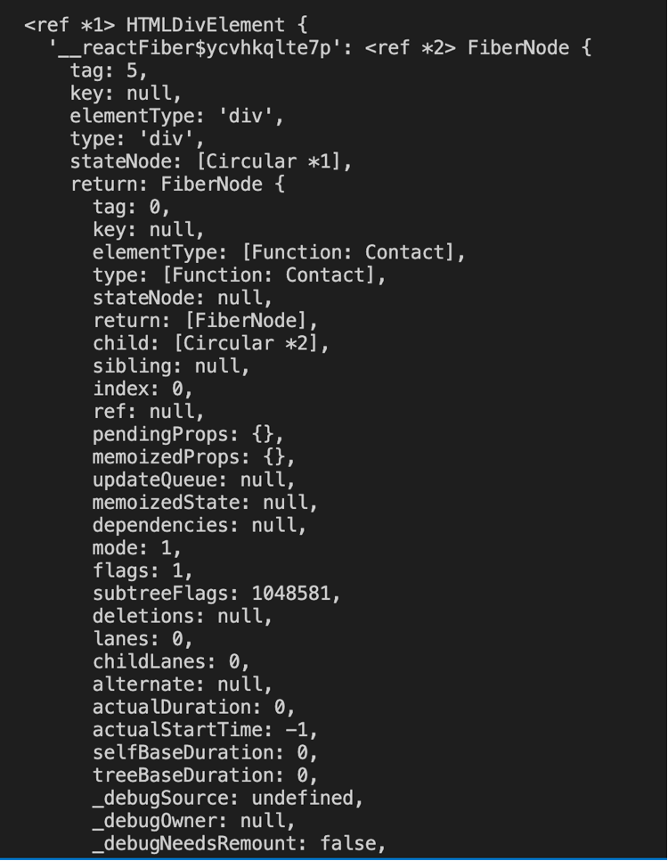

## Part-1 Theory of testing

**What is the need of testing and what the different types of testing we can do as a developer?**

Let's discuss the different types of testing:

1. Manual testing / dev testing: Manually testing the features in the React app. As an example, if as a developer, I work on the search functionality of the app, I would try to manually test the search functionality.

But manual testing/dev testing is not a very efficient approach for testing, because as a developer we need to ensure that the entire flow is working as expected, and not just the specific feature that we developed. The developer who worked on the search functionality cannot be expected to test the other flows like login flow, cart functionality etc. In large scale applications, changes in one component can break changes in other component, hence we need end to end testing to make sure that

2. Automated testing: To overcome the shortcomings of manual testing, we need automated testing that is a code testing the source code.

Let's see the different types of automated testing

- Unit Testing: Means testing the components in isolation. As an example, testing the Header, Body or Footer components in isolation.

- Integration Testing means testing the components in integration, how different components interact with each other. As an example, the 'Add to Cart' functionality impacts the Cart component, Header component etc. Integration testing would focus on integration between these different components.

- End to end testing (E2E testing) - this involves simulating the entire end to end experience, the same way a user would interact with our app. As an example, for our app, it would involve the user entering their name, exploring the restaurant cards, exploring the different restaurant menu categories, adding food items to cart, and checking out to the cart.
  For end-to-end testing, we have different libraries like Cypress, Selenium,Puppeteer (for frontend), Karate (for backend).

For the scope of our cohort, we would not be delving into end to end testing.

**Part-2 Let's deep dive into code**

We'll be using the following libraries for testing our application:

- [React Testing Library](https://testing-library.com/docs/react-testing-library/api/) React Testing Library is a wrapper over the `DOM Testing Library`. There are other testing libraries as well which build on top of the `DOM Testing Library` like `Angular Testing Library`, `Vue Testing Library` etc. If we configure our app using `create-react-app`, then `react-testing-library` comes out of the box. For our usecase, since we configured Parcel bundler ourselves in our application `react-testing-library` won't come out of the box. We'll need to configure it ourselves.

It's important to note that **React Testing Library uses Jest internally**. So, we'll need to configure **Jest** in our app in order to use React Testing Library.

- [Jest](https://jestjs.io) is a Javascript Testing Framework, which can be integrated with a variety of libraries like `React`, `Angular` or `Babel`. Since we are using `JSX` in our application, we'll be configuring `Jest` to be used with `Babel`.

Follow the steps in this [article](https://medium.com/@knowledge.4ward/comprehensive-guide-to-configuring-testing-in-your-react-project-2b8ed78b5e01) to configure Jest and React Testing Library in the project.

Let's also summarise the steps (the same as the ones in the article above) that we are taking to install React Testing Library and Jest in our project:

- Install React Testing Library
- Install Jest
- Install Babel dependencies for Jest
- Configure Babel using `babel.config.js`
- Configure Parcel config file to disable default Babel transpilation :

  Let's understand this in detail. Refer this [documentation](https://parceljs.org/languages/javascript/#usage-with-other-tools) here.

  When we configured Parcel in our React app, it comes with Babel out of the box. While installing Jest, we installed the Babel dependencies for Jest as well. The babel dependencies for Parcel and Jest will conflict with each other. Hence, we disable Babel transpilation for Parcel, and instead ask Jest to use `@parceljs/transformer-js` for transpilation. See the contents of Parcel runtime configuration (.parcelrc) for details:

  ```
  {
    "extends": "@parcel/config-default",
    "transformers": {
      "*.{js,mjs,jsx,cjs,ts,tsx}": [
        "@parcel/transformer-js",
        "@parcel/transformer-react-refresh-wrap"
      ]
    }
  }
  ```

  In the configuration file above, we are asking Parcel to transpile any JS/MJS/JSX/CJS/TS/TSX file by using the `@parcel/transformer-js` library. This effectively disables the babel transpilation for Parcel, and so we don't land in conflicts due to Babel dependencies in Parcel and Jest.

- Jest configuration : Let's understand this in detail, when we use `npx jest --init`

  Among other options, Jest asks us what test environment it should use for testing: Node or JSDOM?

  Let's understand what JSDOM is. JSDOM is headless browser (which means a browser without a graphical user interface), this headless browser is used by the testing libraries to render the React app.

- Install the `JSDOM Library`. For versions of Jest>=28, `jest-environment-jestdom` has to be installed separately.

- Install `@babel/preset-react` library to make JSX work in unit tests

- Include `@babel/preset-react` in the Babel config

- Install `@testing-library/jest-dom`

- Install `redux-mock-store` if we want to use mock store in our tests

**Part-3 Writing the tests**

If we try to use `npm test`, it tells us that it matches the tests using the regex `testMatch: **/__tests__/**/*.[jt]s?(x), **/?(*.)+(spec|test).[tj]s?(x)`, so we need to write the tests in the `__tests__` directory with the extension `.js(x)` or `.ts(x)` or `.test.ts(x)` or `.test.js(x)` etc.

In order to write the tests in Jest, we use the `test` method which takes two parameters, the first paramaters being the test description and the second parameter being the callback function to execute the test.

**Part-3 Writing unit tests for our React app**

We'll firstly be writing a test to test whether the `Contact Us` page mounts on the DOM. In order to assert whether the component renders on the (headless browser), we'll be writing assertions to check whether the heading and other elements of the component are present in the DOM or not.

In order get elements by their role, we use the `getByRole` method. To see what roles we can use in this method, see this [documentation](https://www.w3.org/TR/html-aria/#docconformance)

Since the `Contact Us` page has a `Let's connect image`, we need to provide a mock file for this import. This is because images are stored in the form of binary, and if we don't mock them, Jest tries to interpret the binary and hence runs into errors. See this [Stackoverflow Link](https://stackoverflow.com/questions/46898638/importing-images-breaks-jest-test) for steps on how to resolve.

In order to use the various query APIs like `getByTestId` , `getByRole` etc, we can either `destructure from the render method` or use them from the `screen object`. Both of them work, but the recommended way is it use the `screen object`, according to the creator of React Testing Library. It's because using the query APIs from the screen object is that it allows us to use the query APIs on the fly, compared to using the APIs from render method where we need to destructure the query APIs in advance. See this [Stackoverflow link](https://stackoverflow.com/questions/61482418/react-testing-library-screen-vs-render-queries) for more details.

Let's see the output of the code snippet below:

```
test("should load contact us component", () => {
    render(<Contact />);
    const contactDiv = screen.getByTestId("contact");
    console.log(contactDiv)
})
```



We can see a Javascript object being printed in the console. This is nothing but the React element which is created by using the `React.createElement` API. Recall from the initial lectures that the JSX gets converted to React element behind the scenes, and this is what we are seeing here.

**Part-4**

Let's explore about test suites in Jest. 

Test suites are nothing but a group of tests which are combined together. As an example, all the tests corresponding to a component may be clubbed together under one test suite. In Jest, we combine the tests in a test suite by using `describe`. See the example below:

```
describe("Test Suite", () => {

  test("Test 1", () => {
    // testing logic here
  });

  test("Test 2", () => {
    // testing logic here
  });

});
```

In order to write the test, we can either use the `test` or the `it` function. There is no difference between using both these functions, they are both the same. The nomenclature `it` is used because the test reads like a sentence when the test name starts with "should", as an example the test `it ("should render cart component when cart button is clicked")`, reads like the sentence "it should render cart component button when cart button is clicked".

**Part-6**

Next up, we are writing the unit test for Header component. 

There are some important learnings while trying to render Header Component, let's explore them:

1. As the Header Component loads in the JSDOM headless browser in isolation while testing, it doesn't have access to the store which was provided at the App component. If we carefully explore the Header component, we see that we are subscribing to the store using `useSelector` hook. Hence, we need to configure a mock store which we would provide to the Header component. 

In order to create the mock store, we use `redux-mock-store` library. See this [test](../code/__tests__/Header.test.js) as an example.

2. Similar to the problem discussed above, we are providing a browser router object at the App component, which was accessible throughout the application. Since the `Header` component renders in isolation in the headless JSDOM browser, it won't have access to the browser router object being passed from the App. If we carefully look at the Header Component, we see that we use `Link` component, which needs the browser router object. Hence, we create a browser router object and pass it while rendering the Header component in the test.

See this [test](../code/__tests__/Header.test.js) as an example.

waitFor - write about it, about us tests [TODO]

**Part-8 Integration testing**

