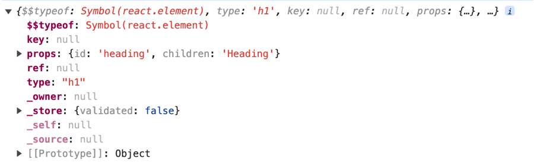

**Default and Named Exports**

Named Exports

Named exports are used when a module needs to expose multiple entities. Each entity is explicitly named during the export process.

Default Exports

Default exports are employed when a module wants to expose a single entity as the “default” export.

## Let's talk about hooks in React

Hooks are nothing but a normal Javascript utility function provided to us by React.

Let's see two of the most used hooks in React:

1. `useState`: It is used to set a state variable.

**What is a state variable?**

- A state variable is used to store the state of a React component.

Let's take a look at the syntax and the logic behind this syntax:

`const [state variable, setState function]= useState(initial state variable)`

A state variable can't be set by using the assignment operator, we need the setState function for that.

**Q. Why do we need a setState function, why can't we do the assignment to the state variable?**

A. Because when we use the `setstate` function, it triggers the React reconciliation algorithm. The React reconciliation algorithm computes the difference between the previous virtual DOM and current virtual DOM, on update of state. Hence, the re-render triggers when the `setState` function is called.

The reasoning behind this syntax is that useState function provioded by React returns an array, and we are destructuring the array. As an example, the syntax is similar to

```
const arr=['Hello','World'];

const [first,second]=arr;

console.log(first,second);
```

Similarly, this is also perfectly valid syntax:

```
const arr = setState(false);
const state=arr[0];
const setState=arr[1];
```

**Why do we need a state variable?**

- Because React keeps a track of only the state variables, and not any Javascript variables. So changes made to state variables only will trigger a useEffect hook.

- It's important to note that any change made to state variable will re-render the component. Rendering in React means to display the component on UI.

React does the re-rendering of component very efficiently and quickly on state variable update. This is one of the factors which makes React apps fast.

## Let's now understand how React is able to re-render the DOM so quickly when the state is changed

The short answer is: Virtual DOM and Reconciliation Algorithm

Let's discuss this in detail:

**What is the virtual DOM?**

The virtual DOM is a representation of the actual DOM. React stores information about the actual DOM in the form of virtual DOM.

The React element which we get by using `React.createElement` is an example of virtual DOM node. See image below:



**What is the use of virtual DOM in React?**

The virtual DOM is useful for the reconciliation algorithm in React.

When the state is updated in React, React computes the diff between the previous virtual DOM and the current virtual DOM. Based on this diff, React only re-renders the diff of the actual DOM. This way, React is able to efficiently re-render the DOM when the state updates. An example of reconciliation algorithm is the **React Fiber** algorithm, which was introduced in React 16.

**The reasons why React Apps are fast**

1. React has very efficient DOM manipulation. It uses the reconcilitation diff algorothm to compute the diff between the previous virtual DOM and the current virtual DOM, and then re-renders only the diff on the actual DOM.

2. The use of bundlers like Parcel, Vite, Webpack etc which do bundling, minification, image compression etc. also make React fast.
