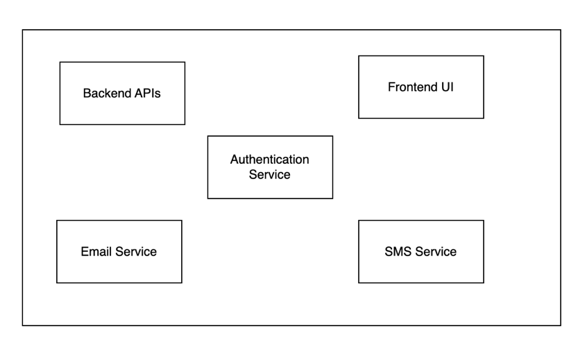
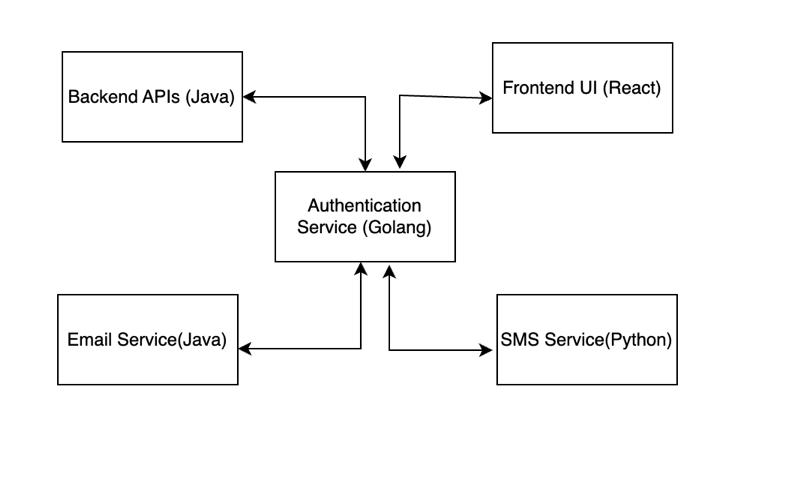
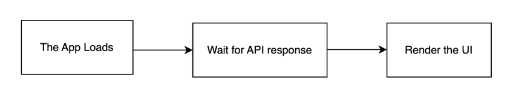
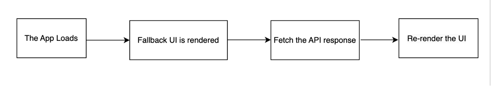
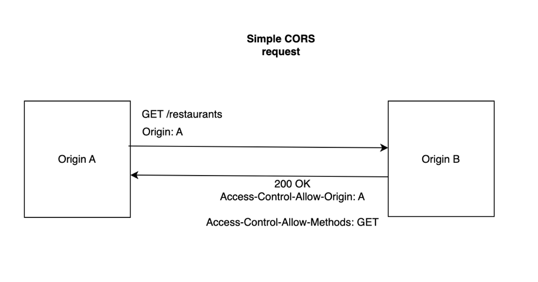
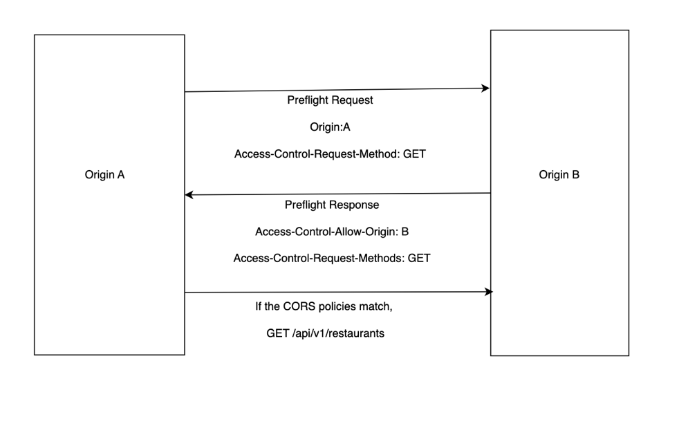
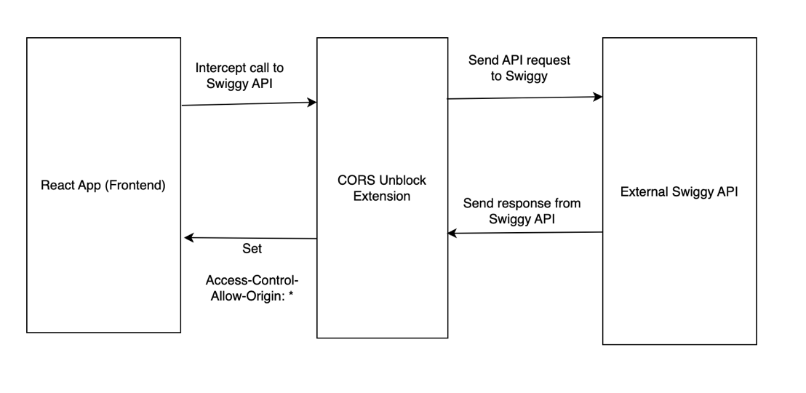
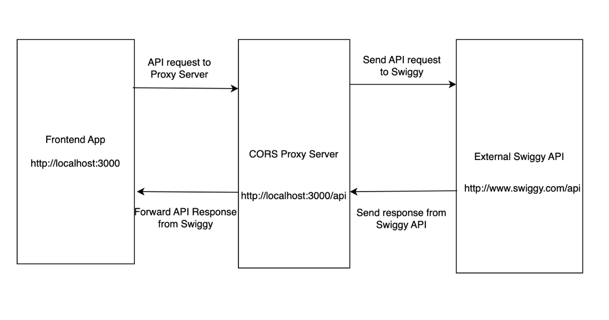

## Monolith and Microservices ##

In a monolith project, different services are tightly coupled within a single architecture. There's a single repository for the entire project. Consider the example below:



In a microservices architcture, different services are hosted independently as different microservices. These different microservices might be written in different languages. Consider the example below:



In a microservices architecture, different microservices communicate with each other through HTTP APIs, message queues or gRPC etc.

Before we can communicate with the external Swiggy APIs to fetch the restaurants, let's take a look at two different approaches and compare them:

Approach-1:



We don't render any UI till the time the API doesn't return a response. Once the API returns a response, we render the UI.

Approach-2:



In this approach, we show a fallback UI (maybe something like a loader or shimmer UI) until the API response is not received. Once the API response is received, we rerender the UI.

Let's do a comparative analysis of both the approaches:

Approach-1

Pros

- No re-render required

Cons

- The user exeperience (UX) is not good as the user doesn't see a UI till the API response is not received or the API errors out.
- The main thread is blocked until the time the API doesn't send a response.

Approach-2 

Pros

- The user experience is good

Cons

- Re-render of component is required.

We'll mostly be going ahead with the second approach in almost all frontend frameworks, because we prefer keeping the user experience good. Re-render is not a problem for us, because:

1. React is really efficient at re-renders because of the efficient reconciliation algorithm which uses the virtual DOM.

2. Only two render cycles are involved, and it's acceptable. Had there been too many re-renders, we would have reconsidered our option.

**Let's talk about the useEffect hook, which is going to be used for our usecase**

The `useEffect` is a hook, which is used to perform side effects in functional components like fetching data from APIs, subscribing to external events or manipulating the DOM.

The syntax for `useEffect` hook is :

```
useEffect(callback function, dependency array)
```

The useEffect callback function is executed after the initial render and everytime the state variables from the dependency array change. As an example, consider the following syntax:

```
useEffect(() => console.log('useEffect called',[fetchedRestauarantList]))
```

In this syntax, we are invoking the callback function after the initial render and everytime the `fetchedRestaurantList` state variable changes.

Important cases in `useEffect`:

1. If an empty dependency array is passed, the component re-renders only after the initial re-render.

2. If the dependency array is not passed, then the component re-renders after the initial re-render and on every state variable and prop update. Basically, it means that the useEffect will be called on every component re-render, and re-render will occur on every state variable/prop change.

**How is `useEffect` suitable for our usecase?**

As discussed before, we want to fetch the API response after the initial render and re-render the component after the API response is received. Hence, `useEffect` hook is perfect for our usecase.

**A note on fetching data using fetch()**

`fetch()` is not provided by Javascript, it is provided by the runtime environment of Javascript.

When using fetch(), it returns a promise. The body key of this resolved promise contains the data in the form of a `ReadableStream`, and the data needs to be converted to `JSON` before it can be parsed. For converting the data from `ReadableStream` to `Javascript object`, we use the `json()` function.

**Let's discuss about optional chaining:** 

If we try to access a property from an undefined or null object, it throws an error. Instead, if we use optional chaining, the expression short circuits to null instead of throwing an error.

See the example below:
```
const obj = undefined

console.log(obj.marks) //throws an error
 
console.log(obj?.marks) //returns an undefined
```

When we first try to make a call to Swiggy's API from localhost, it will block us due to CORS policy. This is the exact error we'll get in the console:

```
localhost/:1 Access to fetch at 'https://www.swiggy.com/dapi/restaurants/list/v5?lat=12.96340&lng=77.58550&is-seo-homepage-enabled=true&page_type=DESKTOP_WEB_LISTING' from origin 'http://localhost:1234' has been blocked by CORS policy: No 'Access-Control-Allow-Origin' header is present on the requested resource. If an opaque response serves your needs, set the request's mode to 'no-cors' to fetch the resource with CORS disabled.
```

## Let's learn more about CORS: ##

**What is origin?**

`Origin` refers to the combination of the scheme (http/https), fully qualified domain name (eg. www.google.com) and the port (eg. 443). The combination of these three entities constitutes an origin. It's important to note that URLs with different directories are not considered to be different origins. Let's see some examples:

`http://www.google.com` and `https://www.google.com` are different origins because of the different schemes.

`http://www.google.com:443` and `http://www.google.com:80` are different origins because of the different ports.

`http://www.google.com` and `http://maps.google.com` are different origins because of different host names.

`http://www.google.com` and `http://www.yahoo.com` are different origins because of different domain names.

`http://www.google.com` and `http://www.google.com/maps` are not different origins, because the definition of origins doesn't include directories.

Reference : [Article link](https://web.dev/articles/same-site-same-origin#:~:text=%22Origin%22%20is%20a%20combination%20of,.example.com%3A443%20.)

**What is cross origin resource sharing mechanism?** 

There's a Cross Origin Resource Sharing (CORS) policy implemented by the browser, what it means is that the browser is extra cautious and takes some extra steps when one origin tries to make a request to another origin. The browser, however, allows communication between different services on the same origin, though (Same Origin Policy(SOP)).

It's important to note that the **CORS policy is implemented by the browser, not by React or Javascript or any other framework.**

Q1. First things first, let's try to understand why the browser enforces the CORS policy. 

A1. Let's say I visit a banking website, and provide my credentials to log in to my account. The session information is stored in the client side cookie, so that I don't need to login again wile visiting different webpages on the banking website.
Now, after sometime, if I visit a malicious website, it can do an HTTP call to the banking website and make unauthrized transactions. The transaction will succeed because the cookies from the banking web site are still there.

Hence, the browser need to be extra cautious when an origin tries to send a request to another origin.

Q2. How am I able to load images and CSS etc from other origins without any problems? Is the CORS policy not applicable there?

A2. Unlike fetch/XHR requests, browsers do allow embedding most content from other websites, such as images, script tags, css, etc, by default. Some possible exceptions are iframes, depending on the site’s configuration, and fonts, depending on the browser.

Q3. When origin A wants to communicate with origin B, what is the process that's followed ? Is the same process followed everytime or it depends?

A3. It depends. There can be two types of requests: simple requests and preflighted requests. Let's see them in detail.

## 1. Simple cross origin requests ##

The criteria to qualify as a simple request is (from the MDN Documentation):

```
A simple request is one that meets all the following conditions:

1. One of the allowed methods: GET, HEAD or POST

2. Apart from the headers automatically set by the user agent (for example, Connection, User-Agent, or the other headers defined in the Fetch spec as a forbidden header name), the only headers which are allowed to be manually set are those which the Fetch spec defines as a CORS-safelisted request-header, which are: Accept, Accept-Language, Content-Language, Content-Type, Range.

2.1 The only type/subtype combinations allowed for the media type specified in the Content-Type header are: application/x-www-form-urlencoded, multipart/form-data, text/plain

3. If the request is made using an XMLHttpRequest object, no event listeners are registered on the object returned by the XMLHttpRequest.upload property used in the request; that is, given an XMLHttpRequest instance xhr, no code has called xhr.upload.addEventListener() to add an event listener to monitor the upload.

4. No ReadableStream object is used in the request.
```

In case a cross origin request qualifies to be a simple request, then the preflight mechanism is not needed. Origin A sends a request to origin B, and checks for `Access-Control-Allow-Origin` header from the response. If `Access-Control-Allow-Origin` lists `origin A`, then the communication between origin A and origin B is successful. Else if `origin A` is not listed in `Access-Control-Allow-Origin`, then origin A won't be able to communicate with origin B, and a CORS poicy error will show up.



## 2. Preflighted cross origin request ##

For requests that don't qualify as simple requests, we need the preflight mechanism. "Preflight" here means that the browser will send a “preflight” request to find out the CORS result prior to sending the actual API request.

The preflight request is a request made to the destination origin, with a couple of HTTP headers like:

1. `Origin` — The source origin that would be making the actual request.
2. `Access-Control-Request-Method` — The method of the actual request being made.
3. `Access-Control-Request-Headers` — A comma-separated list of headers that would be included in the actual request.

Web servers that wish to support CORS requests then respond to preflight requests with the following HTTP headers:

1. `Access-Control-Allow-Origin` — The whitelisted origin, or ‘*’
2. `Access-Control-Allow-Methods` — A list of HTTP methods the web server wishes to permit for cross-origin requests
3. `Access-Control-Allow-Headers` — A list of HTTP headers the web server wishes to permit for cross-origin requests

If any of the information in the response headers does not match the actual parameters of the request, the browser will not send the actual request, preventing unwanted side-effects from the server receiving the cross-origin request.



Let's now see the error message which we got earlier and try to understand what it means:

```
localhost/:1 Access to fetch at 'https://www.swiggy.com/dapi/restaurants/list/v5?lat=12.96340&lng=77.58550&is-seo-homepage-enabled=true&page_type=DESKTOP_WEB_LISTING' from origin 'http://localhost:1234' has been blocked by CORS policy: No 'Access-Control-Allow-Origin' header is present on the requested resource. If an opaque response serves your needs, set the request's mode to 'no-cors' to fetch the resource with CORS disabled.
```

This error is complaining that `Access-Control-Allow-Origin` header is not sent by the Swiggy API, hence the CORS policy in the browser restricts `localhost:1234` origin from making a request to the Swiggy origin.

Let's also learn about the `no-cors` option in request headers.  

In 'no-cors' mode, the browser does not include the Origin header in the request and the server's response is opaque, meaning that its contents cannot be accessed by JavaScript code. This mode is intended for cases where the response from the server is not needed, such as when making a request to a third-party analytics service.

All the documentation referred for this writeup:

[Medium Link for CORS](https://medium.com/@electra_chong/what-is-cors-what-is-it-used-for-308cafa4df1a)

[MDN Documentation for CORS](https://developer.mozilla.org/en-US/docs/Web/HTTP/CORS)

[No-CORS-documentation](https://medium.com/@cybersphere/fetch-api-the-ultimate-guide-to-cors-and-no-cors-cbcef88d371e)

**Ways to handle CORS policy errors**

Now that we have understood what CORS is, let's take a look at the different ways by which we can avoid the CORS policy error when designing frontend apps:

1. Disable the browser CORS policy by running some commands. This isn't a recommended option as it makes our system suscpetible to malicious websites. [Run chrome without CORS](https://alfilatov.com/posts/run-chrome-without-cors/)

2. Using certain chrome extensions like [this](https://chromewebstore.google.com/detail/allow-cors-access-control/lhobafahddgcelffkeicbaginigeejlf) which override the values of headers. Let's understand how they work:



The CORS Unblock extension intercepts the call made to the Swiggy API from the browser. The extension then makes a call to the Swiggy API and gets the response. Before sending the response back to the browser, it sets the `Access-Control-Allow-Origin` as *. The browser interprets this as if `Swiggy API` returned `Access-Control-Allow-Origin` as *, hence it doesn't report a CORS policy violation.

3. Setting up a CORS Proxy server in the frontend, let's understand how this works:



The React app sends a request to the proxy server, which has the same origin as the React app. The proxy server internally routes this request to Swiggy API, and gets the response from Swiggy API. The proxy server then forwards the response back to the frontend. 

In our current project, for local testing, we have setup a CORS proxy server. Local Proxy Server cannot be accessed on production builds. The local proxy server can be accessed [here](../code/.proxyrc). Instructions on how to setup the proxy server can be found here: [Youtube link](https://www.youtube.com/watch?v=N4yUiQiTvwU)

Since the browser interprets the call to the proxy server as a request to the same origin, it doesn't report a CORS policy violation.

4. Use online websites like `corsproxy.org`, they behave similar to the extensions discussed in part 2. We are using this for production builds.

5. Set the `Access-Control-Allow-Origin` and `Access-Control-Allow-Methods` headers in the backend API. This is feasible if we have access to the backend APIs codebase.

**Let's learn and implement Shimmer UI**

As a fallback UI, we can show a loader or a custom message like 'Loading'. However, shimmer is a good user experience to show as a fallback UI, because it gives the user a preview of what the page is going to look like. We can create our own shimmer or use NPM packages to create it. In the current implementation, we are creating a shimmer through NPM package as it gives a better user experience than creating a shimmer on our own.

**Conditional Rendering**

Conditional rendering means rendering different components according to some condition. As an example, if the list of restaurants has not been fetched we show a fallback UI, else we show the restaurant cards.

Let's understand some more points related to `useState` hook :

Consider the code snippet below:

```
const Header = () => {
  console.log('Header rendered');
  const [loggedIn, setLoggedIn] = useState(false);
  return (
    <div className="header">
      <div className="logo-container">
        
      </div>
      <div className="nav-items">
        <ul>
          <li> Home </li>
          <li> About</li>
          <li> Contact</li>
          <li> Cart </li>
          <button onClick={() => setLoggedIn(!loggedIn)}> {loggedIn ? "Logout" : "Login"} </button>
        </ul>
      </div>
    </div>
  );
};

export default Header;
```

Q. When the value of the state variable `loggedIn` changes, does the entire `Header` component get re-rendered or only the button is re-rendered?

A. When the value of the state variable `loggedIn` changes, the entire `Header` component gets re-rendered (This is confirmed from the console log statement). However, due to the efficient React diff algorithm, React knows beforehand what to manipulate in the DOM, hence the re-render is very quick.

Q. `loggedIn` and `setLoggedIn` are both const variables, how is the `setLoggedIn` function then able to change the value of `loggedIn` variable?

A. Good question. When the `setLoggedIn` function is called, it triggers a re-render of the component. The variable `loggedIn` after the render and before the render are different, so we are not actually modifying the value of `loggedIn` state variable, the variables themselves are different before and after the render.

**Whenever a state variable is updated in React, it triggers a re-render of the entire component with the help of reconciliation algorithm.**