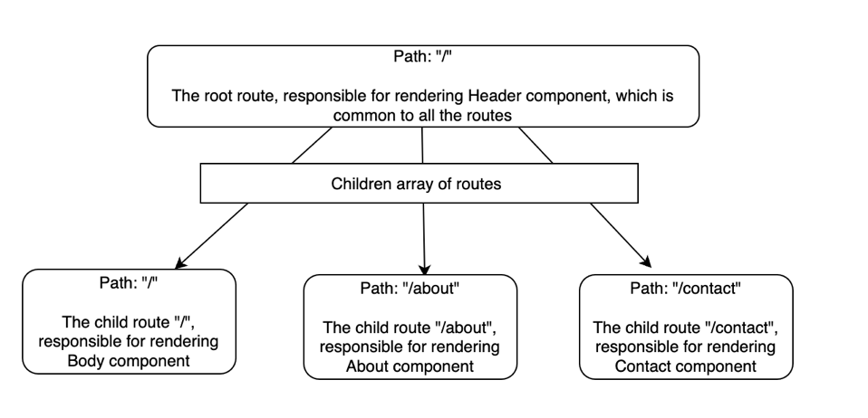
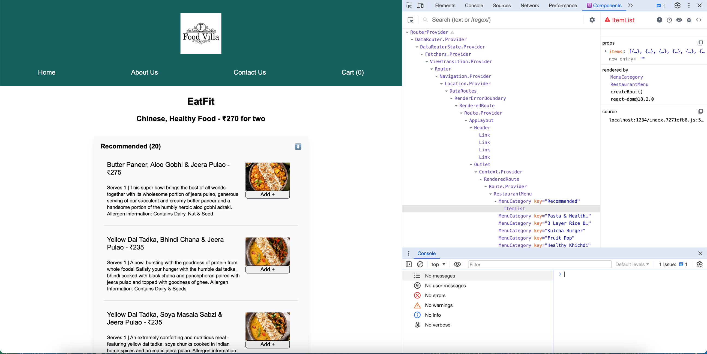
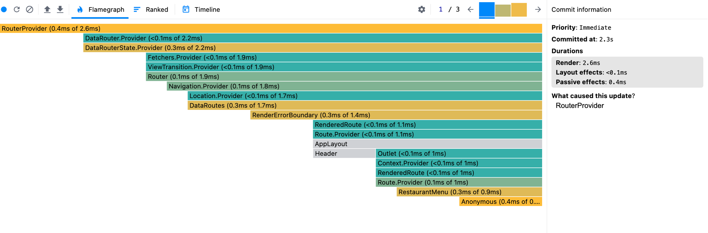
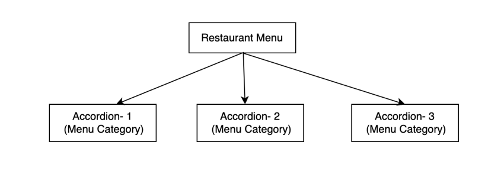

Let's take a look at some of the best practices in React to use the `useState` hook:

1. Never write the `useState` hook outside of the functional component, for two reasons:

   1.1 It will throw an error telling that `Invalid hook call. Hooks can only be called inside of the body of a function component.`

   1.2 Logically, it doesn't make sense to define the state variable outside of the functional component, since by definition, the state variable is a local variable which maintains information about the component, so it should be defined within the component.

2. Always try to write the `useState` in the beginning of the functional component, because it is a good coding practice and also React being Javascript, we want the variable declarations to happen before these variables are used.

3. Don't use the `useState` hook inside an if-else condition. Because the state variable might not be initialised if the state variable is initialised in an `if-else`, and it can lead to inconsistency in the code. Similarly, don't define the state variables in a function or a loop. (This is again to avoid any scoping problems). This is mentioned in the React documentation as well: [React documentation](https://legacy.reactjs.org/docs/hooks-rules.html)

**Let's now explore about Routing in React**

In order to setup routing, we will use `react-router-dom` package in our project.

`createBrowserRouter` from react-router-dom is the recommended router for all React web projects [From the documentation](https://reactrouter.com/en/main/routers/create-browser-router). Hence, we will be going ahead with `createBrowserRouter` router.

In order to understand how to use `createBrowserRouter`, refer to the documentation [createBrowserRouter Documentation](https://reactrouter.com/en/main/start/overview) for understanding.

**Let's explore about `errorElement` in 'react-router-dom'**

From the [documentation](https://reactrouter.com/en/main/route/error-element), when exceptions are thrown in loaders, actions or component rendering, instead of the normal render component, the error component will be rendered.

As an example,

```
<Route
  path="/invoices/:id"
  // if an exception is thrown here
  loader={loadInvoice}
  // here
  action={updateInvoice}
  // or here
  element={<Invoice />}
  // this will render instead of `element`
  errorElement={<ErrorBoundary />}
/>;
```

Action in the above context refers to execution of some logic when clicked on the link, as an example it could be an analaytics call on the click of some action.

**Let's explore the `useRouteError` hook provided by 'react-router-dom'**

It's a common convention in React to start the hook names with `use`.

`useRouteError` from the [documentation](https://reactrouter.com/en/main/hooks/use-route-error), gives access to the error object when an action, loader, or rendering throws an error.

Let's see this in action in the routing configuration [here](../code/src/App.js)

**What is the difference between the NotFound and the Error Component in App.js?**

The Error is a generic component which uses the `useRouteError` hook in order to display any client side error (like 400, 401 or 403), whereas the `NotFound` is a specific component which is used to show an error when a 404 error is encountered.

**Let's now learn about how we can create child routes in React**

Let's understand this with a usecase: I want that when I visit the `/about` route, the Header component should still persist, and the contents of the `About` component should render below the Header component. Let's do a comparative analysis of the different possible approaches:

1. Approach 1: Import the `Header` component in the `About` component, something like:

```
<div className="app">
    <Header />
    <h2 className="about-heading"> Hello there! 👋</h2>
    <p className="about-text">
        This is Namaste Villa, a food ordering platform designed by Girik Garg
    </p>
    <p className="about-linkedin">
        Feel free to connect with me on{" "}
        <a href="https://www.linkedin.com/in/girik-garg" target="_blank">
          <FontAwesomeIcon icon={faLinkedin} className="about-linkedin-icon" />
        </a>
    </p>
    <div className="about-wave-bye-container">
        
    </div>
</div>
```

Drawback of this approach: Will impact performance. As the `Header` component will be re-rendered inside the `About` component, but we ideally don't want the `Header` component to be re-rendered if it is common between the `Body` and the `About` components.

2. Approach-2 : Use `Outlet` from `react-router-dom`. From the documentation of [Outlet](https://reactrouter.com/en/main/components/outlet), an Outlet should be used in parent route elements to render their child route elements. Let's understand this with the help of a diagram and a code snippet:



```
const AppLayout = () => {
  return (
    <div className="app">
      <Header />
      <Outlet />
    </div>
  );
};

const router = createBrowserRouter([
  {
    path: "/",
    element: <AppLayout />,
    children: [
      {
        path: "/",
        element: <Body />,
      },
      {
        path: "about",
        element: <About />,
      },
      {
        path: "contact",
        element: <Contact />,
      },
    ],
  }
]);

```

Let's understand the code:

As depicted in the diagram above, "/", "/contact" and "/about" are child routes of the parent "/" route. The `Outlet` in the `AppLayout` component acts like a placeholder, using the `Outlet` is equivalent to saying:

```
if (path=='/') render Body
else if (path=='/about') render About
else if (path=='/contact')  render Contact
```

Technically speaking, `Outlet` is used to populate the values from the child routes.

The `Outlet` doesn't show up in the `DOM` in the devtools, the devtools only lists the elements liker `div`, `img` etc. So the end user doesn't realize that `Outlet` is being used behind the scenes.

**Difference between using an anchor and Link component for routing**

Using an anchor tag will refresh the page, which is not a good user experience as the new page might take some time to load.

Instead, if we use Link component, it won't reload the page, but render the content in the same page. This is a much smoother user experience. 

It's important to know that a Link component is an anchor tag under the hood, so it will appear as an anchor tag in the DOM.

Link component supports `Single Page Application` whereas anchor tag doesn't.

**Let's talk about a bit about Single Page Application**

A single-page application (web app or website) loads only a single page. It then rewrites the page with new content fetched from a web server as the user interacts with it instead of loading a new page for every interaction. 

A single page application is a website or web application that dynamically rewrites a current web page with new data from the web server, instead of the default method of a web browser loading entire new pages.

React Apps can be made Single Page Applications (SPAs). In such an SPA, everytime we switch to a new route, a network call is not made. Instead, all the components are already fetched when the React app loads for the first time. So, when we navigate between different routes, it is just replacing the components, instead of doing any network call. This gives a much better user experience.

**Let's talk about Client-side routing and Server-side routing**

Server side routing: Any time we navigate to a different route, the browser sends a request to the web server and gets the new page. This webpage is then rendered by the browser.

Client side routing: When we navigate to a different route, the browser does not make a network call to get the different page. Instead, the React app being a single page application (SPA), will only replace the contents of the page with the different component.

**Let's learn about dynamic routing**

We are planning to build a dynamic route to show the restaurant menu when a user clicks on a restaurant card from the homepage. The dynamic route would be `/restaurants/:id`. 

We are using an API call to get the data of restauarant menu from Swiggy API which can be found here [Swiggy Restaurants Menu API](../code/utils/constants.js). In case this API contract changes, please make the changes here [RestaurantMenu](../code/src/RestaurantMenu.js)

In order to read the dynamic ID from the route, we use the `useParams` hook provided by `react-router-dom` library.

We have also built the `Accordion` feature in the restauarant menu here. This was originally discussed in chapter 11 part 2 - `Data is the new Oil`. 

**Design of Accordion**

In order to design the accordion, we fetched the restaurant menu information from Swiggy's APIs using a dynamic route. Corresponding to every restauarant, we have a `RestaurantMenu` component. Corresponding to the different categories in the menu, we have a `MenuCategory` component which corresponds to the `accordion tab`. For every `accordion tab`, we show the accordion body by using the `ItemList` component.

**Let's now discuss about a single collapsible accordion**

Let's not look at how we can build a single collapsible accordion- what we mean by this is that at max one accordion tab can be expanded. If another accordion tab is expanded, then the previous accordion tab is collapsed.

This is discussed in Chapter-11 `Data is the new oil` part 3. We'll learn an important concept of 'lifting the state up' through this exercise.

**Let's also explore about React DevTools :**

React DevTools is a useful browser extension which allows to inspect the React component hierarchies. As an example, see the screenshot below where the `Component tab` shows the hierarchy of the `ItemList` component:



What's also interesting is the fact that we can see the DOM on the left hand side and the data layer (the props, source etc) on the right hand side.

Let's also experiment with `Profiler` from `React DevTools`. Profiler allows us to record the activity in the React App, and shows us the different components which are rendered during the profiling along with the time taken for each component to load. This can be useful to identify parts of an application that are slow and may benefit from optimizations such as memoization. See the screenshot below:



**Let's understand the problem with the help of a diagram:**



The `Restaurant Menu` is the parent component for all the individual `Accordion` components. Each `Accordion` component is managing its own state internally by using a state variable. Now, if we want to collapse one `Accordion` component when another `Accordion` is expanded, the data needs to be passed from one `Accordion` component to another, but this isn't possible in React, since the data can't flow between siblings in React. Hence, we need to "lift the state up", what this means is that instead of having the state variable to show/hide the accordion at the Accordion component (child component), the state variable should instead be lifted to the Restaurant Menu component (parent component). The parent component thus controls the behaviour of the child component.

This brings us to the concept of `Controlled components` and `Uncontrolled components` in React. Let's discuss them:

An `Uncontrolled component` is a component which manages its own state and is not controlled by any other parent component. As an example, the `Accordion` component below is an uncontrolled component, as it manages its own state and is not dependent on its parent component:

```
const MenuCategory = ({ data }) => {
  const [showAccordionBody, setShowAccordionBody] = useState(false);

  const handleButtonClick = () => {
    setShowAccordionBody(!showAccordionBody);
  };

  return (
    <div className="accordion-header">
      <div className="accordion-body" onClick={handleButtonClick}>
        <span className="accordion-header-title">
          {data.title} ({data.itemCards.length})
        </span>
        <span> ⬇️ </span>
      </div>
      {showAccordionBody && <ItemList items={data.itemCards} />}
    </div>
  );
};
```

On the other hand, a controlled component is a component which doesn't maintain its own state. Instead the behaviour of the child component is controlled by the parent component. As an example below, the `MenuCategory` component is a controlled component, as the behaviour of this component is controlled by the props passed down from the parent component `RestaurantMenu`.

```
const MenuCategory = (props) => {
  const { data, accordionIndex, index, openCallBack, closeCallBack } = props;

  const handleButtonClick = () => {
    if (index == accordionIndex) closeCallBack();
    else openCallBack(index);
  };

  return (
    <div className="accordion-header">
      <div className="accordion-body" onClick={handleButtonClick}>
        <span className="accordion-header-title">
          {data.title} ({data.itemCards.length})
        </span>
        <span> ⬇️ </span>
      </div>
      {index == accordionIndex && <ItemList items={data.itemCards} />}
    </div>
  );
};
```

Coming back to the topic, let's discuss in detail how we can design the single collapsible accordion.


We render the `accordion` conditionally, meaning that only the `accordion` only if the specific accordion's index equals `acccordionIndex`. The `accordionIndex` state variable is maintained at the parent component.  In order to set and unset the `accordionIndex` from the child component, we need to find a work around since the data in React typically flows from parent to child components, and not the other way around. In order to overcome this limitation, we pass an `openCallBack` and `closeCallBack` from the parent component to the child component. The child component can invoke these callbacks and modify the `accordionIndex` state variable.